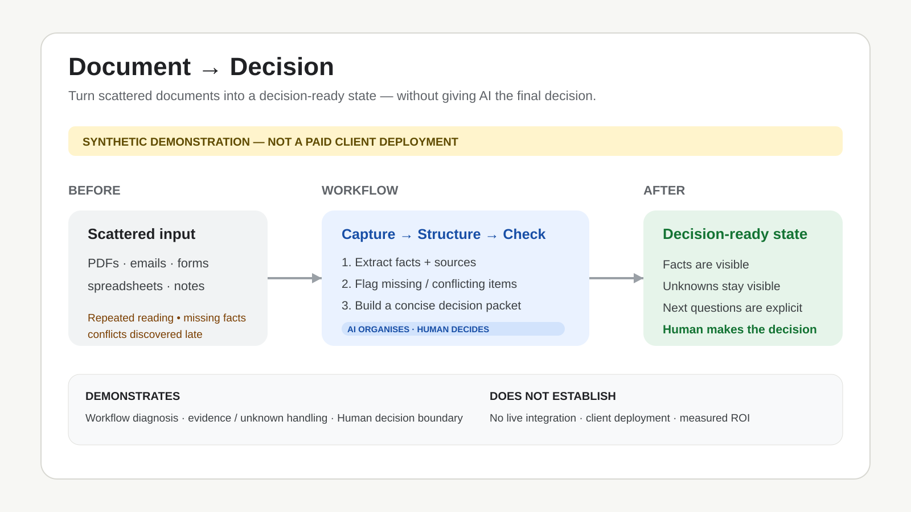

# AI Document-to-Decision Workflow

> **Demonstration Case** — This is a synthetic portfolio case designed to show workflow thinking. It is not presented as a deployed client system or paid client engagement.

## The problem

Document-heavy work often creates friction before a decision is even made. Teams may need to read reports, proposals, policies, spreadsheets, emails, or contracts; extract important details; identify open questions; and then reorganize that information for review.

The challenge is not simply summarisation. The real workflow problem is turning unstructured information into something a person can inspect, refine, and act on.

## Workflow concept

1. **Input** — gather relevant business documents from the available sources.
2. **AI-assisted processing** — read, organise, and prepare information for structured review.
3. **Extract & analyse** — surface key points, relevant entities, questions, and items that need clarification.
4. **Human review** — verify accuracy, add domain knowledge, resolve ambiguity, and edit the output.
5. **Decision-ready output** — prepare useful formats such as an executive summary, structured data, action plan, or report.

## Intended value

A workflow like this can be designed to help:

- reduce repetitive manual reading and information handling;
- surface key information more consistently;
- create clearer review points before decisions are made;
- organise information into formats that are easier to use;
- support faster follow-up without removing human judgement.

These are **intended / potential benefits**, not measured production claims for this demonstration case.

## Human oversight

Human review is part of the workflow rather than an afterthought. Depending on the business context, a reviewer may need to:

- confirm source accuracy;
- resolve ambiguous language;
- add missing business context;
- decide whether recommendations are appropriate;
- approve, reject, or revise the final output.

## Implementation approach

A real implementation would depend on the client's current tools, document types, privacy requirements, volume, review process, and tolerance for error. The goal would be to design the **smallest maintainable workflow** that solves the actual problem rather than adding AI for its own sake.

Possible implementation components could include document intake, extraction, structured prompts or processing logic, validation steps, approval checkpoints, and export into existing business tools.

No specific model, vendor, security architecture, or compliance status is claimed by this demonstration case.

## Skills demonstrated

- AI workflow design
- Business process analysis
- Business process automation
- Process improvement
- Human-in-the-loop system design
- Decision-support workflow design

## Portfolio status

**Type:** Demonstration / synthetic case  
**Client deployment:** No  
**Measured client outcome:** No  
**Purpose:** Public capability demonstration
